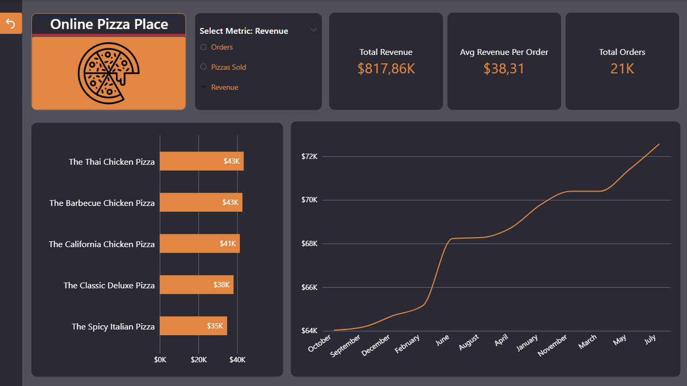
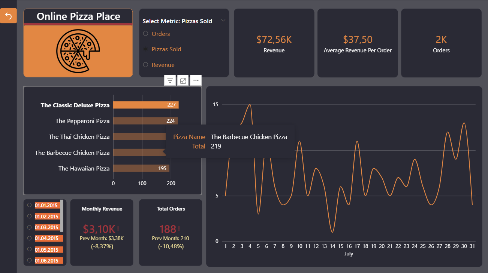
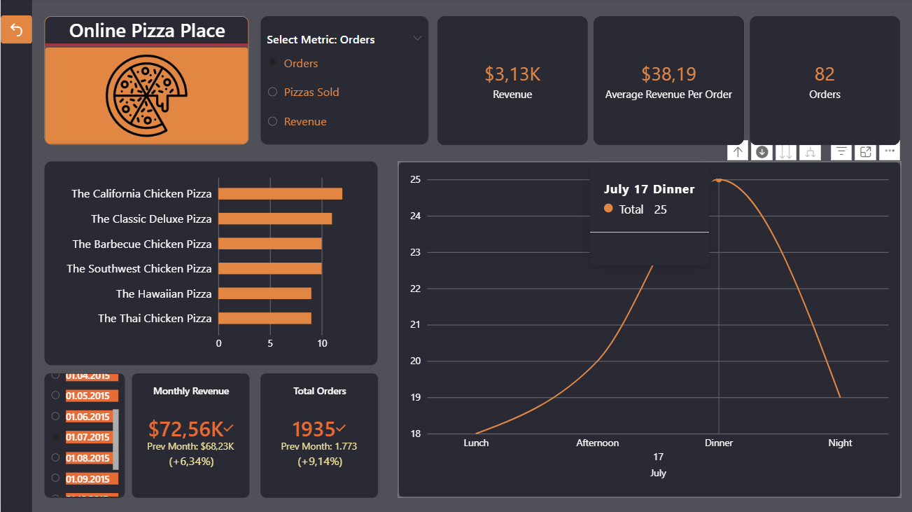

# 🍕 Pizza Satış Raporu - Power BI Portfolyo Projesi

Bu proje, bir pizza restoranının satış verilerini analiz etmek ve temel iş metriklerini takip etmek amacıyla geliştirdiğim bir **Power BI** çalışmasıdır. Veri analitiği portfolyom için hazırladığım bu raporda, ham verileri temizleyerek anlaşılır görsellere dönüştürmeyi amaçladım.

---

## 📊 Ekran Görüntüleri (Dashboard Screenshots)

### 1. Satış Performansı Sayfası

### 2. Operasyon ve Yoğunluk Analizi Sayfası

---

## 🎯 Projenin Amacı ve Odak Noktaları
Bu basit projede, bir işletmenin günlük/aylık performansını izlemesine yardımcı olacak şu sorulara yanıt aradım:
* Toplam ciro, toplam sipariş sayısı ve ortalama sepet tutarı nedir?
* Müşteriler en çok hangi pizza türlerini tercih ediyor?
* Haftanın hangi günleri ve günün hangi saatleri restoran daha yoğun oluyor? (Vardiya ve mutfak planlaması için)

---

## 🛠️ Neler Kullandım?
* **Power BI Desktop:** Verileri görselleştirmek ve raporu hazırlamak için.
* **Power Query:** Ham verilerdeki tarih ve saat formatlarını düzenlemek, temizlemek için.
* **DAX:** Rapor içindeki temel hesaplamaları ve dinamik kartları oluşturmak için.
