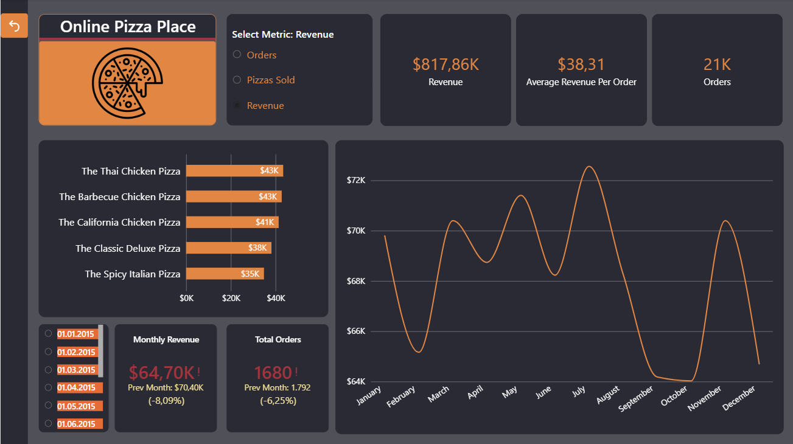

🌐 Türkçe versiyon için [Buraya Tıklayın](README.md)

# 🍕 Pizza Sales Report - Power BI Portfolio Project

This project is a **Power BI** dashboard developed to analyze the sales data of a pizza restaurant and track key business metrics.
Created as part of my data analytics portfolio, this project focuses on transforming raw data into clean, actionable, and easy-to-understand visuals.

---

## 📊 Dashboard Screenshots

### 1. Sales Performance Page

### 2. Operations & Trend Analysis Page

---

## 🎯 Project Objectives & Key Focus Areas
In this straightforward project, I aimed to answer key business questions to help management monitor daily and monthly performance:
* What are the Total Revenue, Total Orders, and Average Order Value (AOV)?
* Which pizza types and categories do customers prefer the most?
* Which days of the week and hours of the day are the busiest? (To support kitchen and staff shift planning)

---

## 🛠️ Tech Stack & Tools Used
* **Power BI Desktop:** Used for data modeling, designing visuals, and building the final dashboard.
* **Power Query:** Used for data cleaning, transforming text data, and formatting date/time columns.
* **DAX (Data Analysis Expressions):** Used to calculate core business metrics and create dynamic KPI cards.
